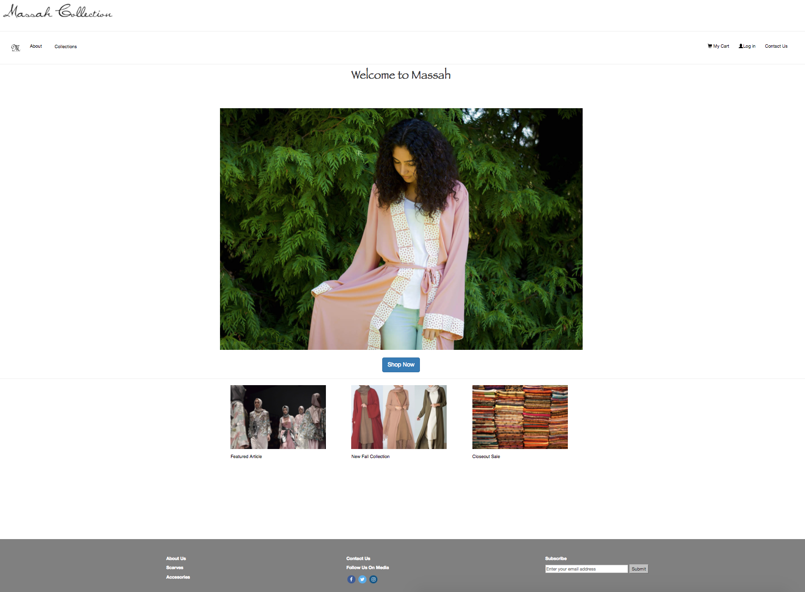
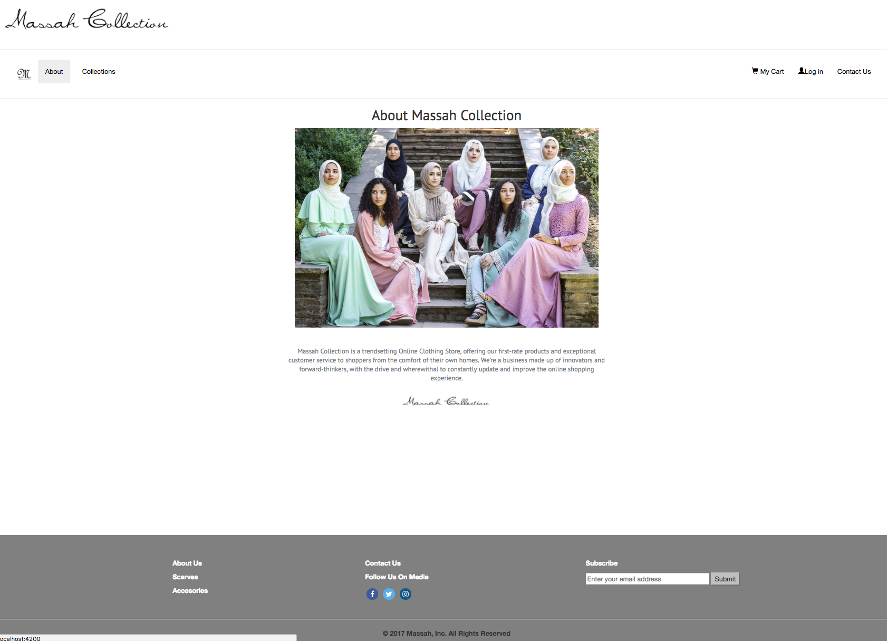
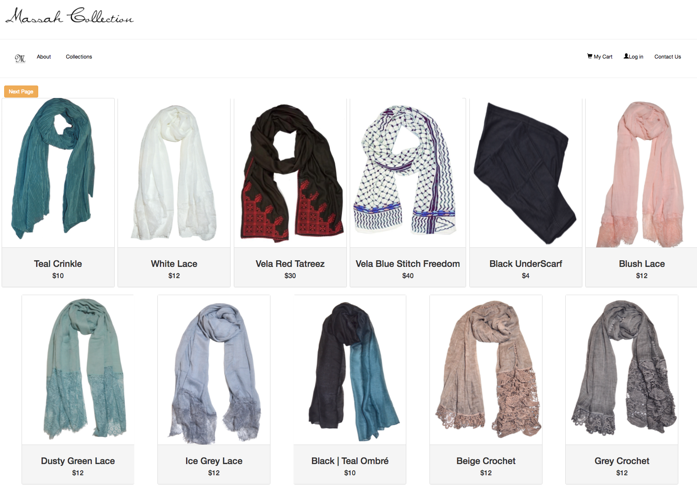
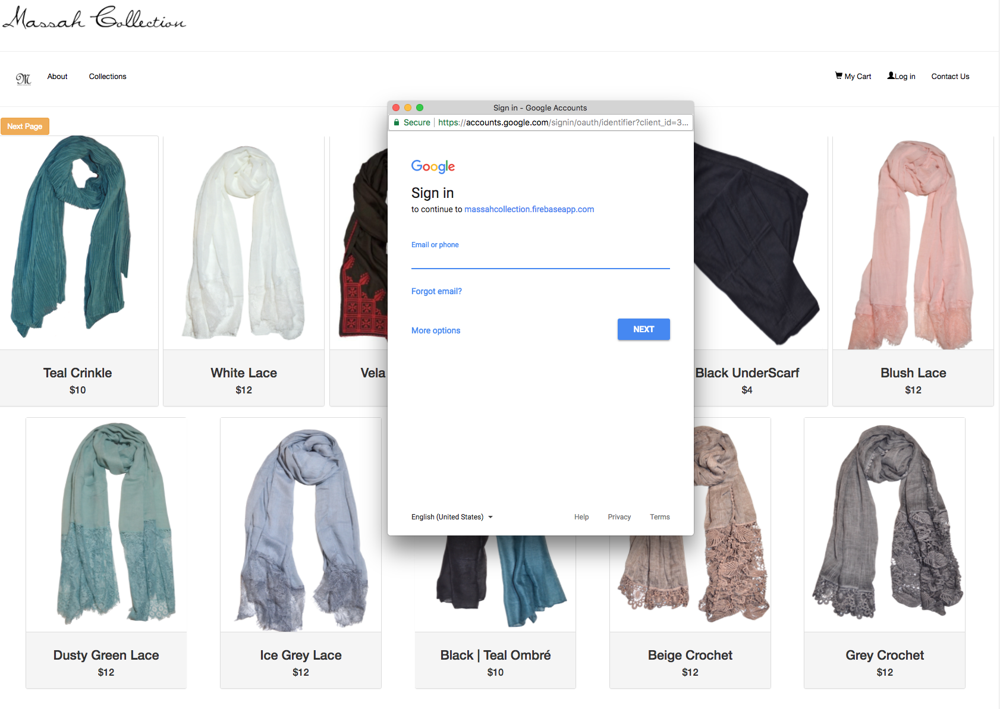
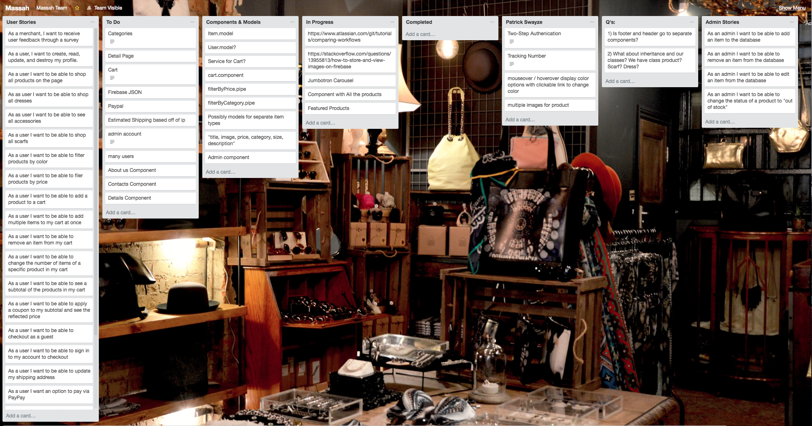

# MassahStore

[Check me out live!](https://massahcollection.firebaseapp.com/)

#### _Massah sells the finest scarves and apparel through our online portal. We source the most beautiful designs in the world

#### By _**Haneen Abu-Khater, Evan Johnson, Kate Mashokha, & Nicholas Raethke**_

## Description

_The Massah webstore runs with a lot of help from Angular2 and a big assist from Firebase for secure data storage.  Users are able to seemlessly navigate our store and checkout with ease and peace of mind.  They can connect with our fabulous social media pages, save items to their cart, and find links to sales, new collections, and interesting articles._

#### Here are a few images from our beautiful site.



Our About Page shares our vision.



Here is a shot of our scarf collection, our number one draw.



We provide secure authentication for our customers through Google Sign in.




## Workflow

#### Trello Digital Stickies & Whiteboarding

Our process began with a roundtable discussion captured on the the Trello Board.  We talked components/models/pipes/services and user stories.

###### Here's that board in action.



We moved on to whiteboarding the layout of our components and pages, which in turn, set us on a path to understand our routing and foresee many of the chokepoints of our work.


***
## For Developers

```console
git clone https://github.com/haneenabu/MassahStore.git
```
```console
cd MassahStore
```
```console
npm install
```
```console
bower install
```
```console
ng serve
```

Run `ng serve` for a dev server. Navigate to `http://localhost:4200/`. The app will automatically reload if you change any of the source files.


## To Do List

1. When browsing scarves on any page but the first, a navigation to the accessories page breaks.
2. Sizing and spacing of all images
3. Shop now button in welcome component
4. Links to images coming from an async call, need to cache for future
5. Cart total is stored in session
6. Email input in footer is fixed length
7. Massah icon in nav bar isn't working
8. 


## Support and contact details

_If you have any questions, [please contact us ](mailto:contact-us@massahcollection.com)._

To get more help on the Angular CLI use `ng help` or go check out the [Angular CLI README](https://github.com/angular/angular-cli/blob/master/README.md).

### License

*MIT License. All Rights Reserved.*

Copyright (c) 2017 **_Massah Collection_**
