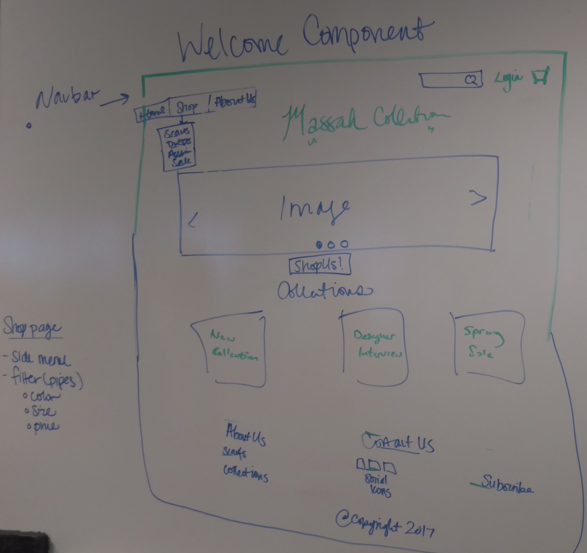
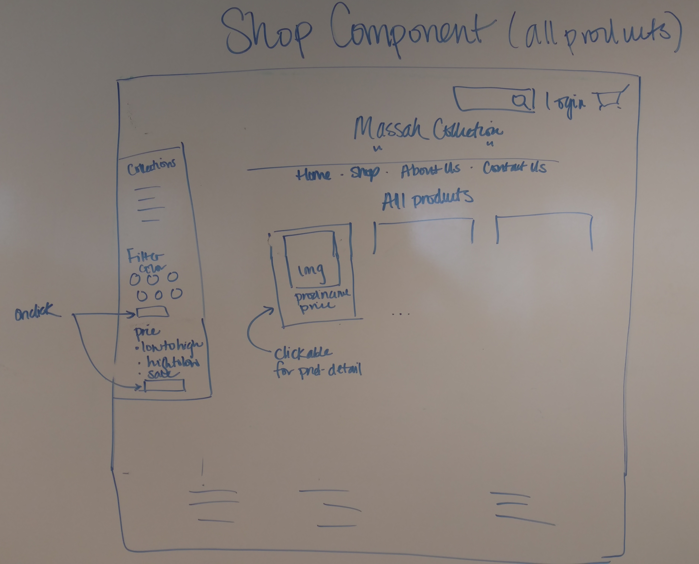
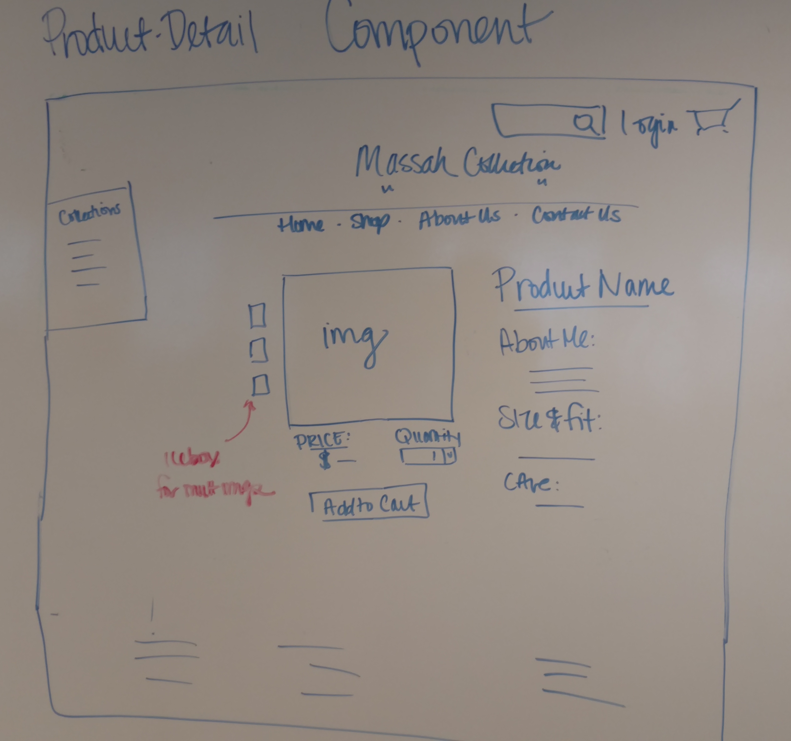
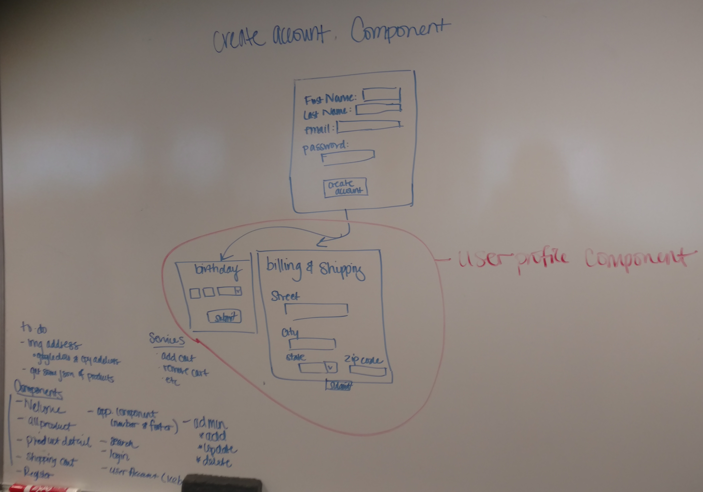

# Massah Store

#### _Massah sells the finest scarves and apparel through our online portal. We source the most beautiful designs in the world, 10.2.17_

#### By _**Haneen the Queen, 7-Evan-11, Empress Kate the Great, & NicoN00b**_

## Description

_The Massah webstore runs with a lot of help from Angular2 and a big assist from Firebase for secure data storage.  Users are able to seemlessly navigate our store and checkout with ease and peace of mind.  They can connect with our fabulous social media pages, save items to their cart, and find links to sales, new collections, and interesting articles._


This project was generated with [Angular CLI](https://github.com/angular/angular-cli) version 1.0.0.

## Workflow

#### Trello Digital Stickies & Whiteboarding

Our process began with a roundtable discussion captured on the the Trello Board.  We talked components/models/pipes/services, user stories, admin stories, and of course, items to give over to Patrick Swayze (that's right, the Cooler).


###### Here's that board in action.


We moved on to whiteboarding the layout of our components and pages, which in turn, set us on a path to understand our routing and foresee many of the chokepoints of our work.

[whiteboard photo documentation](#whiteboard-photo-appendix)


***
## Setup

```console
git clone
```
```console
cd MassahStore
```
```console
npm install
```
```console
bower install
```
```console
ng serve
```

Run `ng serve` for a dev server. Navigate to `http://localhost:4200/`. The app will automatically reload if you change any of the source files.

## Code scaffolding

Run `ng generate component component-name` to generate a new component. You can also use `ng generate directive/pipe/service/class/module`.

## Known Bugs

_{Are there issues that have not yet been resolved that you want to let users know you know?  Outline any issues that would impact use of your application.  Share any workarounds that are in place. }_

## Build

Run `ng build` to build the project. The build artifacts will be stored in the `dist/` directory. Use the `-prod` flag for a production build.

## Support and contact details

_{Let people know what to do if they run into any issues or have questions, ideas or concerns.  Encourage them to contact you or make a contribution to the code.}_

To get more help on the Angular CLI use `ng help` or go check out the [Angular CLI README](https://github.com/angular/angular-cli/blob/master/README.md).

### License

*{Determine the license under which this application can be used.  See below for more details on licensing.}*

Copyright (c) 2017 **_Massah_**


### Whiteboard Photo Appendix










##### Evan demonstrates the Pomodoro Technique.
